# 数据结构

**<font color=ForestGreen>本站主题是学习底层，因此不会进行基础用法的讲解。若读者对基础用法还没掌握建议优先去学习一下基础用法，以便更好理解。</font>**

## 1. Array数组

> 敬请期待
## 2. Slice切片
> 和C、C++中的Array数组一样，在Golang中数组也是定长的，每次定义的时候大小就已经固定了，而这也意味着数组的具有一定的局限性。为提高数组的灵活性，C++中可以用vector，Java中可以选择ArrayList，而在Golang中与他们对应的便是Slice啦。

### 2.1 基础用法

* **初始化**

  1. 使用make初始化，`make([]type,len,cap)`其中cap参数可以省略，省略后其默认值等于len。

  ```go
  slice := make([]int,3,6)	// 使用make初始化Slice
  slice := make([]int,3)		// 省略cap
  ```

  2. 可以通过具体的元素来初始化，其默认的len和cap就是元素的个数。

  ```go
  slice := []int{3,4,5}
  ```

  3. 使用已有的切片或者数组进行初始化，`oldSlice[start:end]`，这种方法可以理解为将已有的切片或者数组进行截取（左闭右开），start和end省略时分别表示从第一个元素开始、到最后一个元素结束。

  ```go
  slice := old[3:6]
  slice := old[3:]
  slice := old[:6]
  slice := old[:]
  ```

* **增加元素**

  1. 使用append函数添加元素。要添加元素的个数可以是1个或以上。

  ```go
  slice = append(slice,6,7,8)
  ```

  2. append也可以将两个slice合并，这里的`old`也是一个slice，在它后面加三个点就可以将其内部元素取出来作为append的参数。

  ```go
  slice = append(slice,old...)
  ```

* **删除元素**
  Slice删除元素的操作可以使用截取的方式。

  ```go
  slice = slice[3:6]
  ```

### 2.2 底层结构

咱先来看一下Slice有哪几部分组成：

```go
type slice struct {
  array unsafe.Pointer
  len int
  cap int
}
```

* **array：** 它的类型是unsafe.Pointer用于指向存储实际数据的数组的指针。这块有点绕，咱们可以简单理解为它就是一个数组，而数组的特点就是在内存中是连续存储的。

* **len：** 它是指当前切片中元素的数量。值得注意的是从字面意思上理解它是长度，但是为了和 ‘数组’的‘长度’做区分，我更喜欢称它为“元素的数量”。
* **cap：** 它是指当前切片的容量，也就是array数组已分配内存的长度。

以上三个参数就构成了我们常用的Slice，看似简单的Slice其实也有很多细节，我们将从Slice的使用角度去分析其底层逻辑。

#### Slice的初始化

Slice的初始化可以有一下几个方式：

1. 使用make初始化。
2. 通过已存在的切片或者数组初始化。
3. 通过具体元素初始化。

```go
slice := make([]int,3)
```

执行以上代码后，可以在内存中得到这样一个Slice：

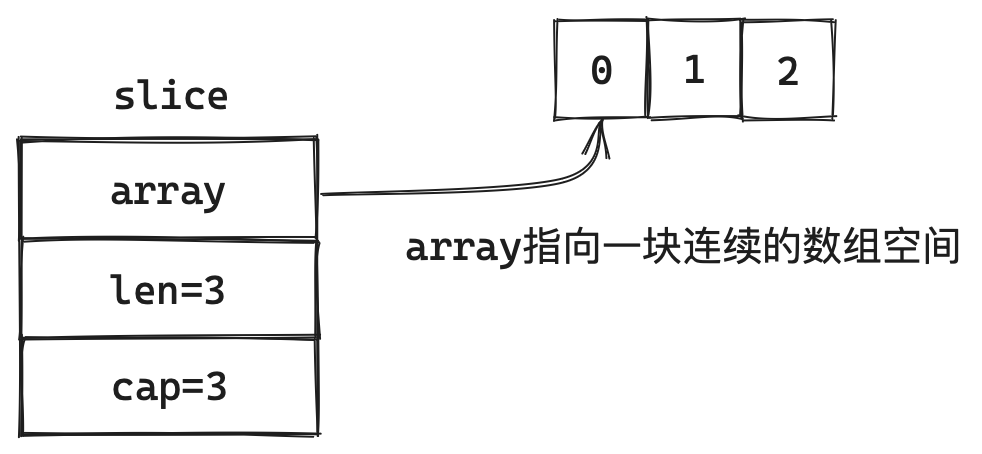

当我们传入的len为3的时候，那么Slice的前三个元素的value都会被初始化为对应 `type` 的0值，如果是复杂类型的数据初始化的值则是 `nil` 。另外需要注意的是我们在make中并没有传入cap的容量，所以这时的cap容量是等于len的，如果我们对其进行append操作就会触发Slice的扩容了。当然我们在make的时候可以传入初始的cap容量：`make([]int,3,6)`那么此时的cap为6，再进行append就不需要额外扩容了。

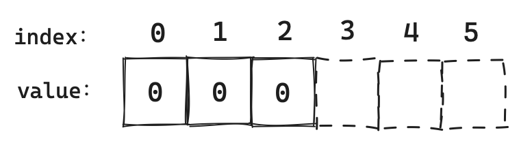

#### Slice的遍历

上文我们介绍到Slice在初始化的时候cap是可以省略的，但是len可不行。而len这个参数也是Slice最为重要的参数之一，从何说起呢？

通过上文的例子可以看到当我们将len设置为3，cap容量设置为6的时候，在内存中其实已经分配好了，但是如果我们想访问下标为`3`的元素，那就会抛出"下标越界"，这是因为Slice访问元素的边界是由len决定的。尽管内存中已经为`3,4,5`分配好了内存空间，但此时的len为3，那么我们只能访问`0,1,2`这三个下标的元素，同样当我们使用for循环对其进行遍历的时候也是以len作为边界。

#### Slice的扩容规则

由于Slice是在已有的数组空间上进行存储数据，因此就意味着一定会有数据已经存满了数组空间的情况，其实也是对应了`cap == len`的情况，那么此时再进行`append`就需要对Slice进行扩容，底层实现就是重新创建一个足够长的数组，再将原来的数据拷贝过去。

```go
slice = append(slice,10)
```

我们在len=3，cap=3的一个Slice上进行添加元素操作就会发生一次扩容。

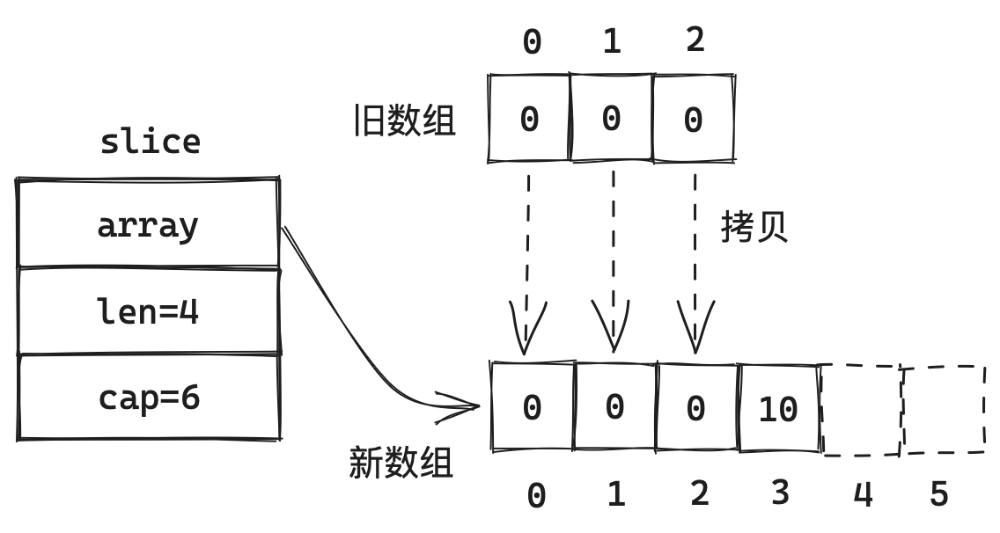

当我们进行一次append的时候，可以看到len加了1变成了4，cap容量从3变成了6。这里咱就可以讨论一下Slice的扩容机制啦！在进行append操作时，如果当前容量不足以存储新的元素那么就会发生扩容，扩容会调用一个叫做`growslice`的函数，它返回的是一个新的Slice，所以我们只要分析一下`growslice`的代码就可以知道Slice的扩容规则了。由于1.18版本之后的扩容机制发生了些许改变，因此我们需要分开讨论。

* **1.18之前**

  我们可以具体看一下`growslice()`函数中关于cap的代码：

  ```go
  // src/runtime/slice.go
  
  func growslice(et *_type, old slice, cap int) slice {
    
    // ......
    
    newcap := old.cap
  	doublecap := newcap + newcap
  	if cap > doublecap {
  		newcap = cap
  	} else {
  		if old.cap < 1024 {
  			newcap = doublecap
  		} else {
  			// Check 0 < newcap to detect overflow
  			// and prevent an infinite loop.
  			for 0 < newcap && newcap < cap {
  				newcap += newcap / 4
  			}
  			// Set newcap to the requested cap when
  			// the newcap calculation overflowed.
  			if newcap <= 0 {
  				newcap = cap
  			}
  		}
  	}
    
  	// ......
    
    return slice{p, old.len, newcap}
  }
  ```

  这里`growslice`函数中的cap参数指的就是扩容的期望容量，而通过分析代码不难看出：

  * 如果期望容量大于当前容量的2倍，则新Slice的容量就是期望容量的大小。
  * 如果当前容量小于1024，那么新Slice的容量则是原来的2倍。
  * 如果当前容量大于1024，那么新Slice的容量每次增加25%，直到新容量`>=`期望容量。

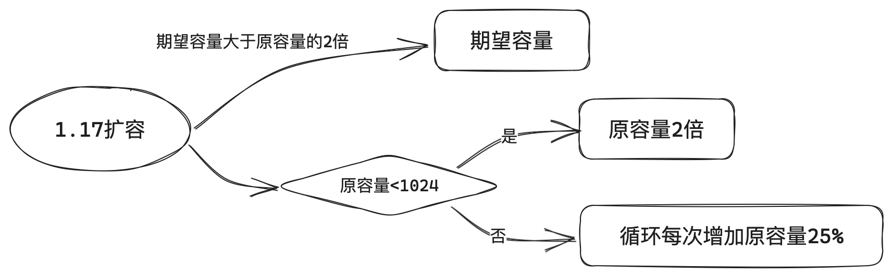

* **1.18之后**

  ```go
  // src/runtime/slice.go
  
  func growslice(et *_type, old slice, cap int) slice {
    
    // ......
    
  	newcap := old.cap
  	doublecap := newcap + newcap
  	if cap > doublecap {
  		newcap = cap
  	} else {
  		const threshold = 256
  		if old.cap < threshold {
  			newcap = doublecap
  		} else {
  			// Check 0 < newcap to detect overflow
  			// and prevent an infinite loop.
  			for 0 < newcap && newcap < cap {
  				// Transition from growing 2x for small slices
  				// to growing 1.25x for large slices. This formula
  				// gives a smooth-ish transition between the two.
  				newcap += (newcap + 3*threshold) / 4
  			}
  			// Set newcap to the requested cap when
  			// the newcap calculation overflowed.
  			if newcap <= 0 {
  				newcap = cap
  			}
  		}
  	}
  
    
  	// ......
    
    return slice{p, old.len, newcap}
  }
  ```

  在1.18过后原本1024的阈值修改成了256，扩容规则也略微发生了变化：

  * 如果期望容量大于当前容量的2倍，则新Slice的容量就是期望容量的大小。
  * 如果当前容量小于256，那么新Slice的容量则是原来的2倍。
  * 如果当前容量大于256，那么新Slice的容量每次增加`旧容量+3*256`的 25%，直到新容量`>=`期望容量。

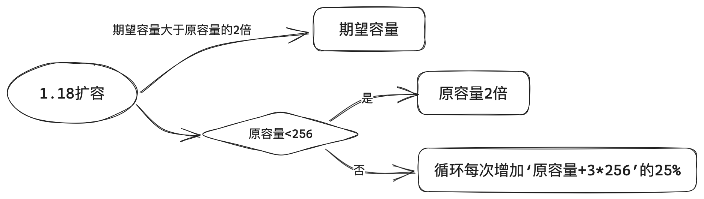

### 2.3 使用细节

了解了底层结构，我们可以使用一个例子来加深一下对Slice印象，这样也可以帮助我们更好地理解Slice。

#### Slice在函数中传递是”值传递“还是”引用传递“？

详见参考：[Slice为什么不能在传参后append？](https://mp.weixin.qq.com/s/OojWQzNjbO6tj8gX2qoGtA)

```go
func change(course []string) {
  course[0] = "java"
}
func main() {
  course := []string{"go", "grpc", "orm"}
  change(course)
  fmt.Println(course)
}
//输出:[java grpc orm]
```

实践出真知，我们简单写了几行代码，把course传递到change函数中，修改在change中的第0个元素，最后在主函数中将course输出。

可以发现输出的结果是`[java grpc orm]`，course被修改了，所以我们可以初步得出结论：**Slice在Golang中是“引用传递”**。但真的是这样嘛？

```go
func change(course []string) {
  course = append(course, "java")
}
func main() {
  course := []string{"go", "grpc", "orm"}
  change(course)
  fmt.Println(course)
}
//输出:[go grpc orm]
```

我们简单修改一下代码，在change函数中使用append给course添加一个元素。这时输出的却是`[go grpc orm]`，可我们明明添加了一个元素啊？去哪了呢？

```go
func change(course []string) {
  course = append(course, "java")
  fmt.Println("change :",course)
}
```

在change和main中分别打印输出一下，change中输出了`change :[go grpc orm java]`。那么问题来了，为什么change中的course可以正常输出`java`，而main中的course就没有呢？这不是***值传递***的特性嘛，可我们刚刚得出的结论明明是***引用传递***呀！

实际上Slice的函数传递是**值传递**，当我们将course传递给change函数时，拷贝了一份course中的内容到change函数中，此时就有了两个Slice，而Slice中的array是一个指针，因此两个Slice都指向了同一个数组空间。

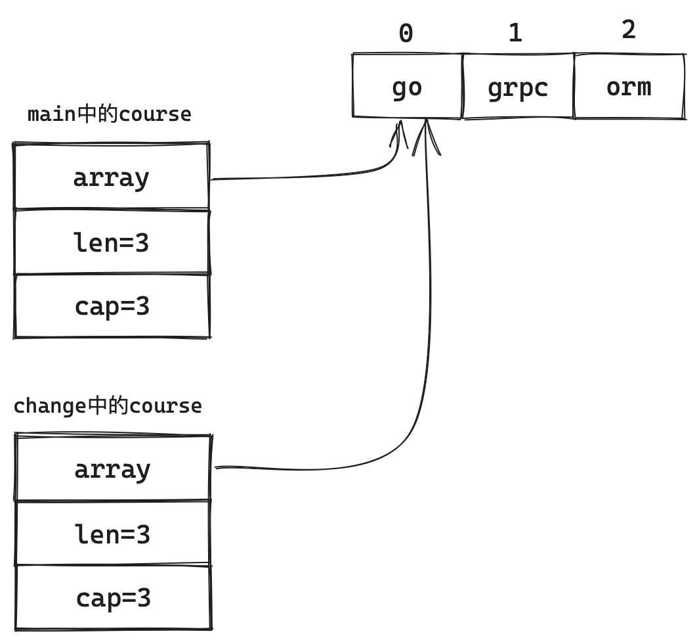


还记得我们讲的扩容机制嘛？当Slice进行扩容的时候，需要重新开辟一块内存空间，将旧值复制进去，因此在change中的course它会开辟一块新的内存用于存放数据，并且指向它，但是main中的course指向的数组地址还是原来的，因此就读不到`java`这个数据了。

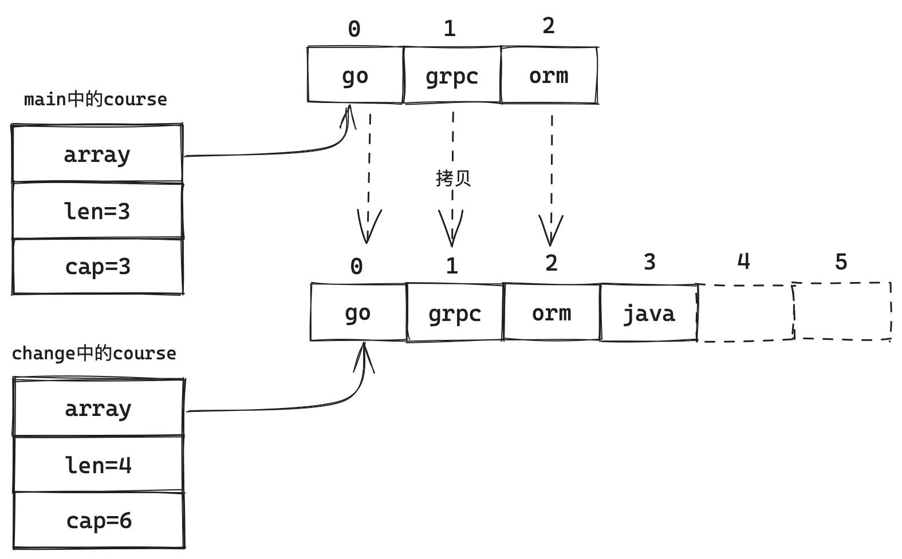

## 3. String字符串

> 敬请期待
## 4. Map哈希表
> map当然是一种比较常见的数据类型，主要特点是读取、修改、删除数据的时间复杂度一般都在O(n)，本质上是以空间换时间的思想来提高查询效率。

### 4.1 基础用法

* **初始化**

  1. map的初始化同样可以使用`make(map[key_Type]val_Type,size)`，其中size参数可以省略，它的作用是确定map的大小（本质是hmap结构体中B的值，具体请看底层部分）。

  ```go
  dict := make(map[string]int)
  ```

  2. 直接定义，也将已有的key-value写出来。

  ```go
  dict := map[string]int{}
  
  dict := map[string]int{
    "a":1,
    "b":2
  }
  ```

* **读取数据**

  1. 直接读取，若当前key对应的值不存在则会返回nil。

  ```go
  val := dict["a"]
  ```

  2. 也可以用两个变量获取，`ok`是一个`bool`类型的数据，为false时说明当前值不存在，即`val`为nil。

  ```go
  val,ok := dict["a"]
  ```

* **写入or修改数据**

  ```go
  dict["c"] = 3
  ```

* **删除数据**

  调用`delete`内置函数可以将map中的值删除，第一个参数为要删除的map，第二个参数为要删除的`key`。

  ```go
  delete(dict,"a")
  ```

### 4.2 哈希原理

在讲解底层结构之前，我们需要先了解两种常见的解决**Hash冲突**的方法，分别是： **开放地址发法** 、 **拉链法**。

#### 哈希冲突
我们都知道map中的键值对是存储在Bucket（桶）中的，那么当我存储一个”键值对“时，需要对key进行hash运算，再使用当前桶的数量对hash值进行取余就可以确定我们要存储在哪一个桶中。

```go
h := hash(key)							// 计算当前key的hash值
index := h % len(buckets)		// 将计算出的hash值对桶的个数进行取余
```

经过上述操作就可以确定我这个key要存储在哪个位置。但是肯定有一种情况：我有两个不同的key，计算出的`index`是相同的。假设key1的hash值是21，key2的hash值是31，恰好我当前桶的数量是10，那么对key1和key2取余都可以得到`index`的值为1。如果我先将key1的值存储到bucket中，那么等我存储key2的时候该何去何从呢？这就是哈希冲突，接下来介绍两种常见的解决方法。

#### 开放地址法

开放地址法并不要求当前的桶必须存储对应的hash值，若当前的桶中有值那么就往后查找，直到有一个桶为空，就把当前的数据存储到这个桶中。

* **存储**
  假设我们要存储一个hash值为51的key，当前桶的数量为10。通过hash计算我们可以得出我们要存储的key应该存放在1号桶中，可是1号桶已经有值了，于是就向后查询2号桶；可2号桶也有值，那么继续找3号桶。最终当找到4号桶时发现其为`nil`，那最终将key存储在4号桶中（具体数据会包含对应的key和value，这里使用hash表示该数据省略了其具体数据部分）。

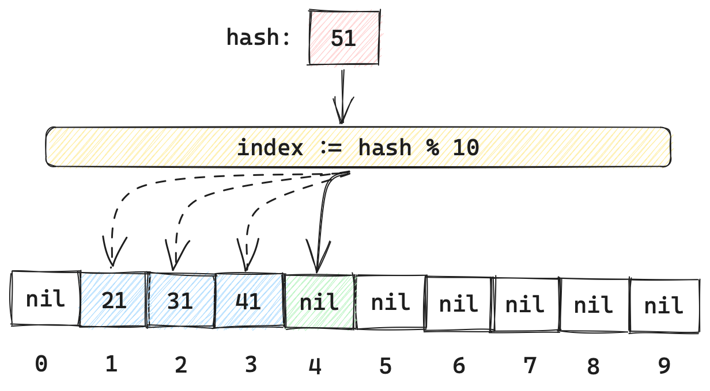

* **读取**
  和存储一样，首先确定当前key对应的桶，然后已经对比，如果当前桶中的key和自己的key不一致，那就继续查询下一个桶。若查找的下一个桶中的数据为`nil`，那么说明当前key并没有在当前map中存在。

  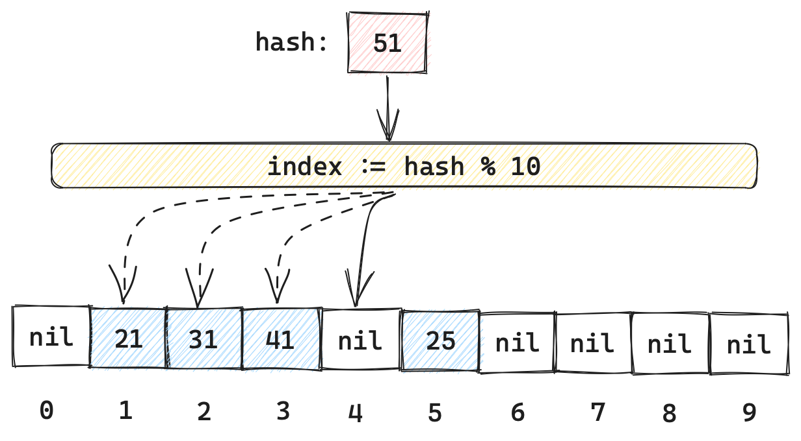

我们同样假设读取hash值为51的key，确定为1号桶后依次比对，直到遍历到4号桶发现其值为`nil`，那么说明hash值为51的桶在这个map中不存在。如果我们读取hash值为41的数据，同样在确定1号桶后依次遍历，直到3号桶发现key值相等，那么就可以读取该数据了。

这里也有一个问题，如果我将2号桶中的数据删除了，还可以读取到hash值为41的数据嘛？答案是可以，这里的删除并不会将其设置为`nil`，而是设置为`empty`状态标记为删除，这样可以让hash值为41的数据可以继续往后遍历。

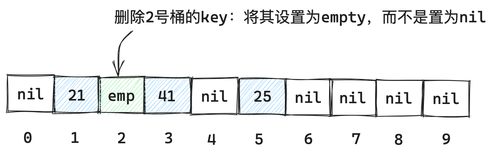

* **不足**
  很显然这样的解决方案如果在bucket很多都存满的情况下效率可能会降为O(n)

#### 拉链法

顾名思义，拉链法是使用链表的方式将同一个桶中的元素以链表的形式进行链接，以此来解决Hash冲突。这也是大多数语言的首选方案。

* **存储**
  我们同样以存储hash值为51的元素为例：在经过计算后确定了`index`的值为1，即将要存储在1号桶，但由于1号桶中已经有元素了，于是就遍历1 号桶的链表直到为`nil`，将我们的51元素存到这个链表的末尾。

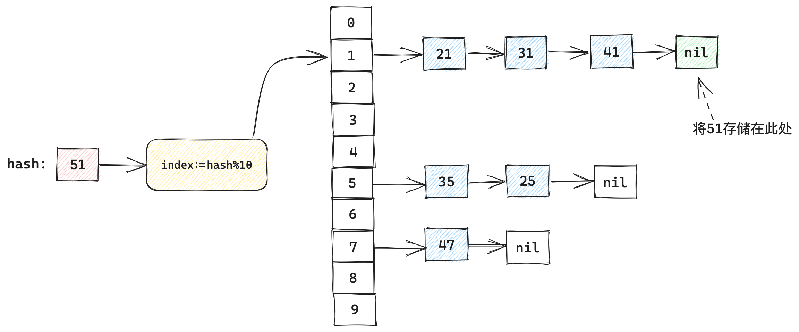

* **读取**
  对于拉链法元素的读取就很好理解了。在确定好哪一个桶过后，只需要遍历该桶找到一个key的值和要查找的key相等即可，若没有找到则说明数据不存在。

### 4.3 底层结构

#### hmap

map的源码在`src/runtime/map.go`这个文件中，我们第一眼看到的就是hmap这个结构体，这个也是map的主体。

```go
// Go版本 1.20
type hmap struct {
	// Note: the format of the hmap is also encoded in cmd/compile/internal/reflectdata/reflect.go.
	// Make sure this stays in sync with the compiler's definition.
	count     int // # live cells == size of map.  Must be first (used by len() builtin)
	flags     uint8
	B         uint8  // log_2 of # of buckets (can hold up to loadFactor * 2^B items)
	noverflow uint16 // approximate number of overflow buckets; see incrnoverflow for details
	hash0     uint32 // hash seed

	buckets    unsafe.Pointer // array of 2^B Buckets. may be nil if count==0.
	oldbuckets unsafe.Pointer // previous bucket array of half the size, non-nil only when growing
	nevacuate  uintptr        // progress counter for evacuation (buckets less than this have been evacuated)

	extra *mapextra // optional fields
}
```

* **count :** 用于记录map中键值对的个数，使用`len()`内置函数可以获取。因此获取map中键值对个数的时间复杂度为O(1)
* **flags :** 用于标记当前map的状态，如：是否在扩容状态。
* **B :** 这个参数就是map的大小，用于确定”桶“的数量。但B的值并不直接表示桶的数量，2的B次方才是”桶“的数量。
* **noverflow :** 溢出桶近似的数量。
* **hash0 :** hash种子。
* **buckets :** 它是指针类型，但本质其实是`bmap`数组，它的长度为2的B次方。如果`count`元素的个数为0，那么这个buckets则为nil。
* **oldbuckets :** 它和`buckets`一样，也是`bmap`数组，它的作用是在map进行扩容的时候存储旧的`buckets`，如果当前map不在扩容，则为nil。
* **nevacuate :** 这是一个指针类型的数据，它用于记录扩容的进度，小于该值的桶已经完成了迁移。
* **extra :** `mapextra`结构体指针，用于存储溢出桶。

> Tips: 溢出桶指的是：`buckets`数组中的`bmap`链接了多个`bmap`（拉链法），那么这些多出来的`bmap`就属于溢出桶。当溢出桶达到一定数量说明有很多数据无法再O(1)的时间复杂度内获取数据，这时就需要进行扩容。这里简单贴一张图解释一下，红色部分就是溢出桶的部分，具体我们等到讲解`mapextra`的时候细说。

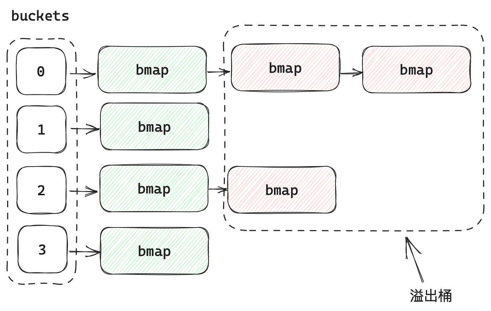

#### bmap

接下来我们需要介绍一下`bmap`这个结构体，这个结构体其实就是单个”桶“的结构，`buckets`的类型就是`bmap`。

```go
// A bucket for a Go map.
type bmap struct {
	tophash [bucketCnt]uint8
}
```

我们看`src/runtime/map.go`这个文件中的`bmap`结构体是上面这个样子的，但其实`bmap`内部的结构在源码中并没有显式，而是在编译期才确定下来的，因为map中的key和value的类型可能是各种各样的，而注释中写到bmap存储key-value的形式并不是一个key一个value进行存储的，而是把key放一起，value也放一起，正确的结构体应该这样：

```go
type bmap struct {
    topbits  [8]uint8
    keys     [8]KeyType
    values   [8]ValueType
    overflow uintptr
}
```

* **topbits :** 这个一个uint8的数组，它存储的是每个key进行hash计算后的高8位数据。
* **keys :** 它存储了所以key值，类型在编译期确定下来。
* **values :** 它就是每个key对应的value值，类型同样是在编译期确定的。
* **overflow :** 链接的下一个bmap的指针，即溢出桶

```go
	// NOTE: packing all the keys together and then all the elems together makes the
	// code a bit more complicated than alternating key/elem/key/elem/... but it allows
	// us to eliminate padding which would be needed for, e.g., map[int64]int8.
	// Followed by an overflow pointer.
```

通过注释我们知道这么设计bmap的好处就是保证了bmap内部的内存对齐，而对于bmap的操作也是通过计算偏移量来实现的。具体的bmap结构就是这样的啦。


#### mapextra

这个结构体是用来存储溢出桶的，具体结构如下：

```go
type mapextra struct {
	// If both key and elem do not contain pointers and are inline, then we mark bucket
	// type as containing no pointers. This avoids scanning such maps.
	// However, bmap.overflow is a pointer. In order to keep overflow buckets
	// alive, we store pointers to all overflow buckets in hmap.extra.overflow and hmap.extra.oldoverflow.
	// overflow and oldoverflow are only used if key and elem do not contain pointers.
	// overflow contains overflow buckets for hmap.buckets.
	// oldoverflow contains overflow buckets for hmap.oldbuckets.
	// The indirection allows to store a pointer to the slice in hiter.
	overflow    *[]*bmap
	oldoverflow *[]*bmap

	// nextOverflow holds a pointer to a free overflow bucket.
	nextOverflow *bmap
}
```

* **overflow :** 一个切片的地址，切片的类型是`bmap`结构体的指针。它的作用是将所有的溢出桶都维护成一个顺序表。
* **oldoverflow :** 用于维护`oldbuckets`中的溢出桶，在map进行扩容的时候会用到。
* **nextOverflow :** 为了减少溢出桶的频繁创建和删除，Golang维护了一个溢出桶池。nextOverflow就指向了溢出桶池中的一个空闲的桶，当需要使用溢出桶时则直接使用nextOverflow就可以了。

#### 整体结构

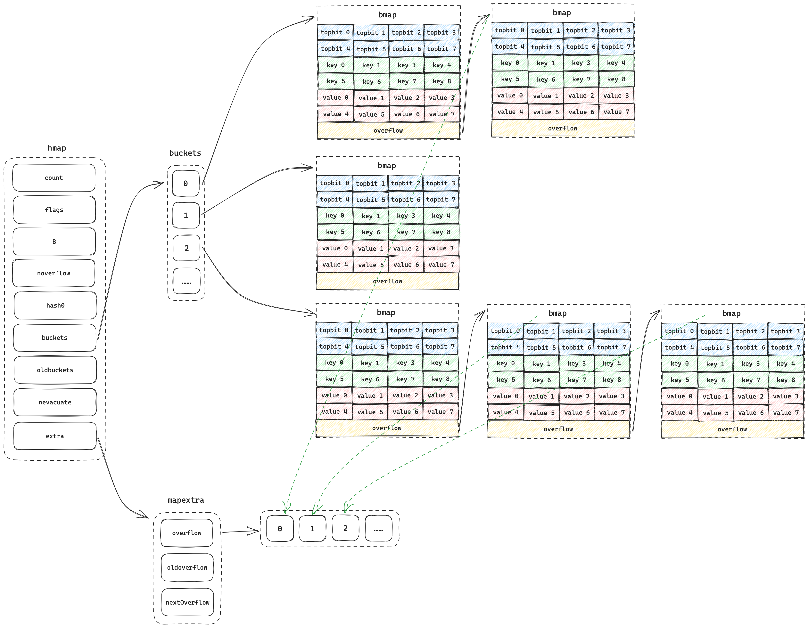