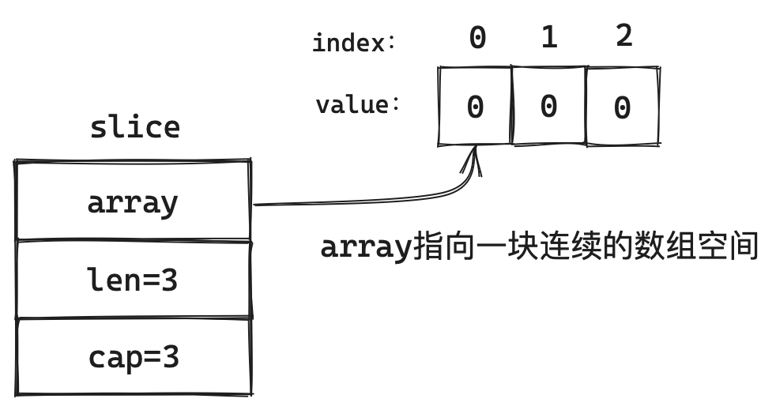

# 数据结构

**<font color=ForestGreen>本站主题是学习底层，因此不会进行基础用法的讲解。若读者对基础用法还没掌握建议优先去学习一下基础用法，以便更好理解。</font>**

## Array数组

> 敬请期待
## Slice切片
> 和C、C++中的Array数组一样，在Golang中数组也是定长的，每次定义的时候大小就已经固定了，而这也意味着数组的具有一定的局限性。为提高数组的灵活性，C++中可以用vector，Java中可以选择ArrayList，而在Golang中与他们对应的便是Slice啦。

### 底层结构

咱先来看一下Slice有哪几部分组成：

```go
type slice struct {
  array unsafe.Pointer
  len int
  cap int
}
```

* **array：** 它的类型是unsafe.Pointer用于指向存储实际数据的数组的指针。这块有点绕，咱们可以简单理解为它就是一个数组，而数组的特点就是在内存中是连续存储的。

* **len：** 它是指当前切片中元素的数量。值得注意的是从字面意思上理解它是长度，但是为了和 ‘数组’的‘长度’做区分，我更喜欢称它为“元素的数量”。
* **cap：** 它是指当前切片的容量，也就是array数组已分配内存的长度。

以上三个参数就构成了我们常用的Slice，看似简单的Slice其实也有很多细节，我们将从Slice的使用角度去分析其底层逻辑。

#### Slice的初始化

Slice的初始化可以有一下几个方式：

1. 使用make初始化
2. 通过已存在的切片或者数组初始化
3. 通过具体元素初始化

值得注意的是当使用make进行初始化时可以添加len和cap两个参数，而cap可以省略，当cap省略时初始化的切片len和cap的大小是一样的。

```go
s := make([]int,3)
```

执行以上代码后，可以在内存中得到这样一个Slice




## String字符串

> 敬请期待
## Map哈希表
> 敬请期待